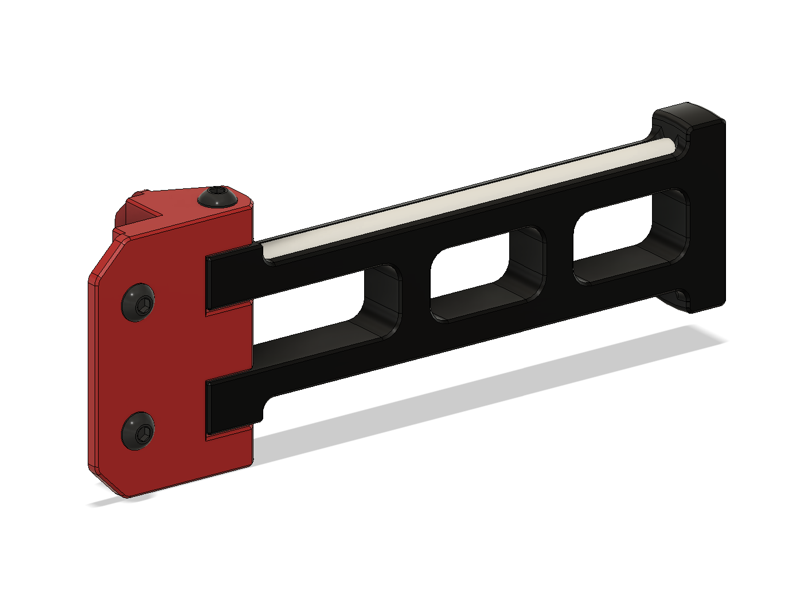

A folding spool holder arm for Voron 0 / Voron 0.1, inspired by [cipher94's mod on Thingiverse](https://www.thingiverse.com/thing:4572395) and the stock design.
There are two versions of the hinge, each in 2, 2.5, & 3mm panel thicknesses: one uses the two pre-inserted nuts in the stock build, and the other is stronger, using an additional nut which can be inserted into the side extrusion if the bottom panelclip is removed first.
By default, the arm extends to the rear and folds against the back panel. To switch it to extending from, and folding against, the side simply mirror both printed parts.

# BoM
This BoM doesn't include the PTFE tubes, though for clarity it does include some hardware which is reused from the V0 and V0.1 builds.
Component | Quantity
--- | :-:
M3x8 BHCS | 2-3
M3x40 BHCS | 1
