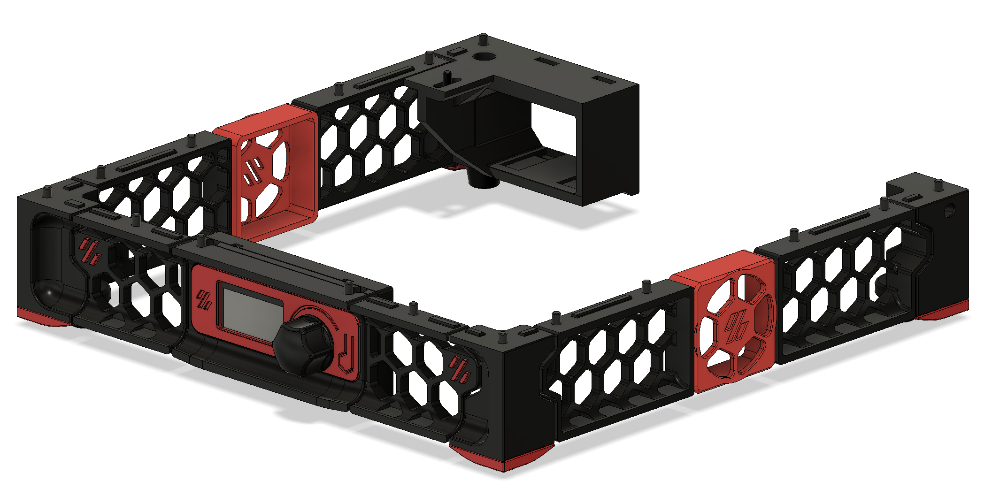

# Overview
A version of the Trident skirt for the V0 and V0.1, supporting the C14 inlet and V0 display by Timmit.

The goal was to implement the aesthetic of the Trident skirt in the smaller form factor, using hardware and screws already in the V0.1 BoM where possible.

There are two C14 inlet sections: one designed for the inlet I bought, which differs from the one in CAD, and a BoM-compatible version.

A section will be designed to replace the display section for those without the display.

The display housing requires a specific assembly order:
1. Add heatset inserts to display_middle
2. Add VHB to display_front where the screen_insert will go
3. Hook display_middle on to display_front
4. Fix in place using two 2x10mm self-tapping screws
5. Press screen_insert into place
6. Attach display_rear with four M3x12 BHCS
7. Insert two M3x6 BHCS into the pre-inserted nuts, leaving ~2mm gap between head and frame
8. Place display housing on to these screws and push back until front is flush with frame
9. You may need to adjust the screws a couple of times to get a good fit

# BoM
This BoM doesn't include the rubber feet, though for clarity it does include some hardware which is reused from the V0 and V0.1 builds.
It assumes skirt to front and sides, with only the C14 at the rear. You'll need some VHB to hold the fans or fan blanks to the skirts.
## Common
Component | Quantity
--- | :-:
M2x6 BHCS | 8
M3x6 BHCS | 10
M3x8 BHCS | 4
M3x40 BHCS | 5
M3 hex nut | 3
M3 threaded insert | 1
## Display
Component | Quantity
--- | :-:
V0 Display (LDO recommended) | 1
M2x10 self-tapping screw | 2
M3x6 BHCS | 2
M3x12 BHCS | 4
M3 threaded insert | 4
